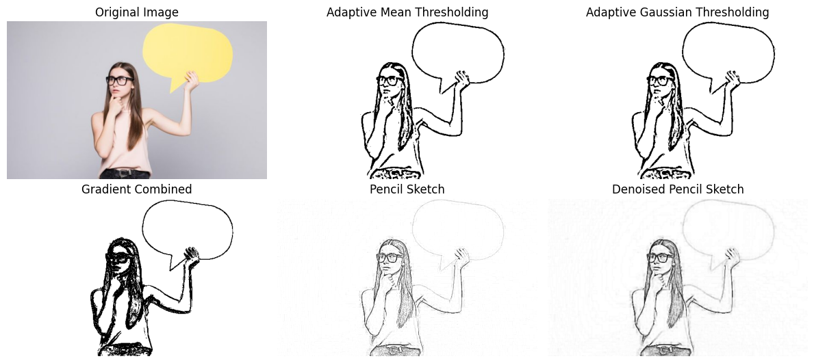
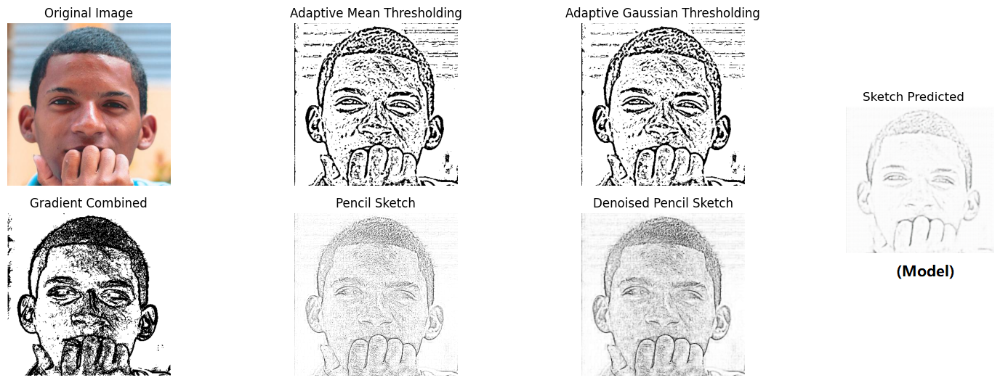
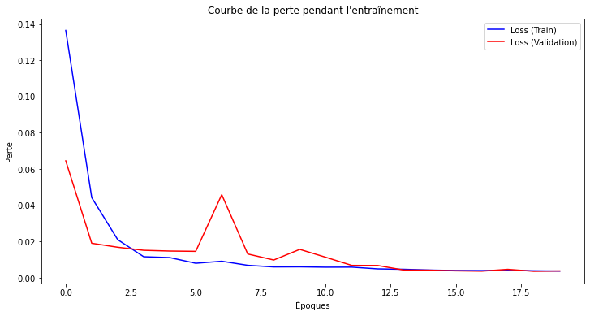

# ✏️ Real Image to Pencil Sketch Conversion

## 📌 Project Overview
This project converts real images into pencil sketches using two approaches: **classical image processing** and a **deep learning model**. The classical approach applies denoising, thresholding, and contour detection, while the deep learning model uses a CNN-based encoder-decoder architecture to generate sketches from RGB images. The goal is to compare the quality of sketches produced by both methods.

---

## 📂 Dataset
- **RGB Faces and Pencil Sketches**: Two folders containing real RGB images and their corresponding pencil sketch versions, used for training the deep learning model.
- You will find the dataset in the folder named data.

---

## 🔍 Project Workflow

### **1. Classical Image Processing**
Apply denoising, thresholding, contour detection, and dodge effect to create sketches.

```python
import cv2
import numpy as np

img = cv2.imread("test2.jpg")
denoised_img = cv2.fastNlMeansDenoisingColored(img, None, h=10, hColor=10, templateWindowSize=7, searchWindowSize=21)
gray = cv2.cvtColor(denoised_img, cv2.COLOR_BGR2GRAY)
blurred = cv2.medianBlur(gray, 5)
_, th_binary = cv2.threshold(blurred, 127, 255, cv2.THRESH_BINARY)
grad_X = cv2.Sobel(gray, cv2.CV_32F, 1, 0, ksize=-1)
grad_Y = cv2.Sobel(gray, cv2.CV_32F, 0, 1, ksize=-1)
gradient_combined = cv2.addWeighted(cv2.convertScaleAbs(grad_X), 0.5, cv2.convertScaleAbs(grad_Y), 0.5, 0)
kernel_sharpening = np.array([[-1, -1, -1], [-1, 9, -1], [-1, -1, -1]])
sharpened = cv2.filter2D(img, -1, kernel_sharpening)
adjusted_gray = cv2.cvtColor(sharpened, cv2.COLOR_BGR2GRAY)
inv = 255 - adjusted_gray
gaussgray = cv2.GaussianBlur(inv, ksize=(15, 15), sigmaX=0, sigmaY=0)
pencil_sketch = cv2.divide(adjusted_gray, 255 - gaussgray, scale=256)
denoised_pencil_sketch = cv2.bilateralFilter(pencil_sketch, d=5, sigmaColor=75, sigmaSpace=75)
gamma = 2
denoised_pencil_sketch_clear = np.array(255 * (denoised_pencil_sketch / 255) ** gamma, dtype=np.uint8)
cv2.imwrite('denoised_pencil_sketch_clear.jpg', denoised_pencil_sketch_clear)
```

### **2. Data Preparation for Deep Learning**
Load and preprocess RGB and sketch images, normalizing pixel values.

```python
import cv2
import numpy as np
import os

def load_colored_faces(folder_path, target_size=(224, 224)):
    images = []
    for filename in sorted(os.listdir(folder_path)):
        img = cv2.imread(os.path.join(folder_path, filename))
        if img is not None:
            img = cv2.cvtColor(img, cv2.COLOR_BGR2RGB)
            img = cv2.resize(img, target_size) / 255.0
            images.append(img)
    return np.array(images)

def load_pencil_faces(folder_path, target_size=(224, 224)):
    images = []
    for filename in sorted(os.listdir(folder_path)):
        img = cv2.imread(os.path.join(folder_path, filename), cv2.IMREAD_GRAYSCALE)
        if img is not None:
            img = cv2.resize(img, target_size) / 255.0
            images.append(img)
    return np.array(images)
```

### **3. Deep Learning Model**
Train a CNN-based encoder-decoder model to generate sketches.

```python
from tensorflow.keras.models import Sequential
from tensorflow.keras.layers import Conv2D, Conv2DTranspose, ReLU, BatchNormalization

def build_pencil_sketch_model(input_shape=(224, 224, 3)):
    model = Sequential([
        Conv2D(64, (3, 3), strides=(2, 2), padding='same', input_shape=input_shape),
        ReLU(),
        BatchNormalization(),
        Conv2D(128, (3, 3), strides=(2, 2), padding='same'),
        ReLU(),
        BatchNormalization(),
        Conv2D(256, (3, 3), strides=(2, 2), padding='same'),
        ReLU(),
        BatchNormalization(),
        Conv2DTranspose(128, (3, 3), strides=(2, 2), padding='same'),
        ReLU(),
        BatchNormalization(),
        Conv2DTranspose(64, (3, 3), strides=(2, 2), padding='same'),
        ReLU(),
        BatchNormalization(),
        Conv2DTranspose(3, (3, 3), strides=(2, 2), padding='same', activation='sigmoid')
    ])
    return model

model = build_pencil_sketch_model()
model.compile(optimizer='adam', loss='mse')
model.fit(X_train, y_train, validation_split=0.1, epochs=50)
model.save('pencil_sketch_model.keras')
```

Model Summary:
```
Model: "sequential_1"
_________________________________________________________________
 Layer (type)                Output Shape              Param #   
=================================================================
 conv2d_3 (Conv2D)           (None, 112, 112, 64)      1792      
 re_lu_5 (ReLU)              (None, 112, 112, 64)      0         
 batch_normalization_5       (None, 112, 112, 64)      256       
 conv2d_4 (Conv2D)           (None, 56, 56, 128)       73856     
 re_lu_6 (ReLU)              (None, 56, 56, 128)       0         
 batch_normalization_6       (None, 56, 56, 128)       512       
 conv2d_5 (Conv2D)           (None, 28, 28, 256)       295168    
 re_lu_7 (ReLU)              (None, 28, 28, 256)       0         
 batch_normalization_7       (None, 28, 28, 256)       1024      
 conv2d_transpose_3          (None, 56, 56, 128)       295040    
 re_lu_8 (ReLU)              (None, 56, 56, 128)       0         
 batch_normalization_8       (None, 56, 56, 128)       512       
 conv2d_transpose_4          (None, 112, 112, 64)      73792     
 re_lu_9 (ReLU)              (None, 112, 112, 64)      0         
 batch_normalization_9       (None, 112, 112, 64)      256       
 conv2d_transpose_5          (None, 224, 224, 3)       1731      
=================================================================
Total params: 743939 (2.84 MB)
Trainable params: 742659 (2.83 MB)
Non-trainable params: 1280 (5.00 KB)
_________________________________________________________________
```

### **4. Testing the Deep Learning Model**
Test the model on new RGB images.

```python
import tensorflow as tf
import cv2
import numpy as np
import matplotlib.pyplot as plt

model = tf.keras.models.load_model('pencil_sketch_model.keras')
test_images = []
for f in sorted(os.listdir('data/RGB_Faces_test'))[:4]:
    img = cv2.imread(os.path.join('data/RGB_Faces_test', f))
    img = cv2.cvtColor(img, cv2.COLOR_BGR2RGB)
    img = cv2.resize(img, (224, 224)) / 255.0
    test_images.append(img)
test_images = np.array(test_images)
predicted_sketches = model.predict(test_images)
```

---

## 📊 Results
- **Classical Approach**: 
- **Deep Learning Model**: 
- **Comparison**: 
- **Training Loss**: 

---

## 📦 Requirements
```bash
pip install opencv-python numpy matplotlib tensorflow keras
```

---

## ▶️ How to Run
1. Clone the repository:
   ```bash
   git clone  https://github.com/ali27kh/Real_Image_Pencil_Sketch.git
   cd Real_Image_Pencil_Sketch
   ```
2. Install dependencies.
3. Run your own model with your data.
4. Test.

---

## 📌 Key Insights
- The **classical approach** produces sketches using denoising, thresholding, and dodge effect but lacks fine details.
- The **deep learning model** generates more realistic sketches with better edge preservation, thanks to its encoder-decoder architecture.
- The comparison image highlights the deep learning model's superior detail retention over classical methods.
- Normalization and consistent image sizing (224x224) are critical for model performance.

---

## 📜 License
MIT License
